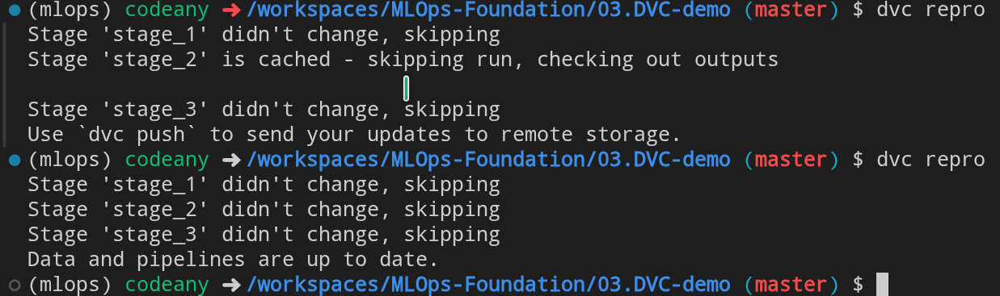
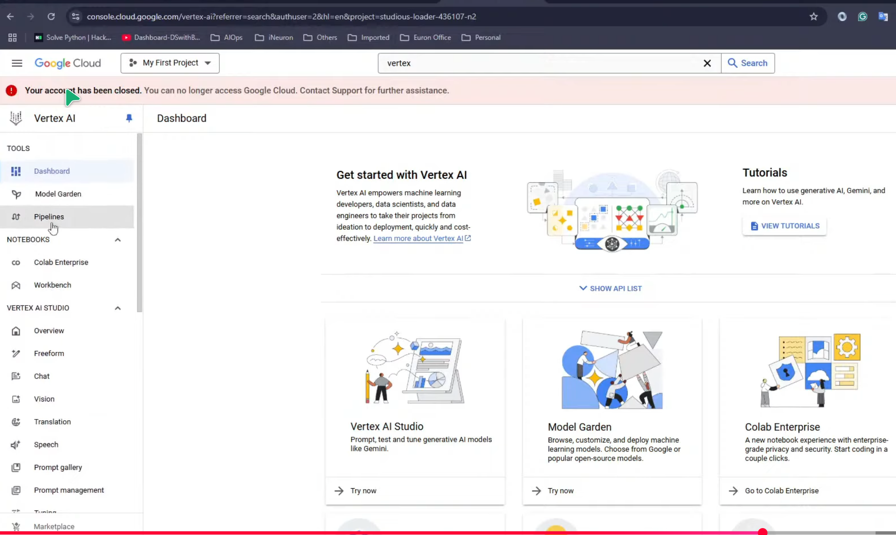
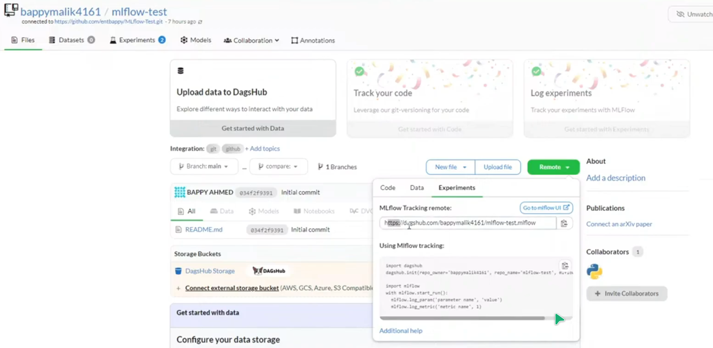
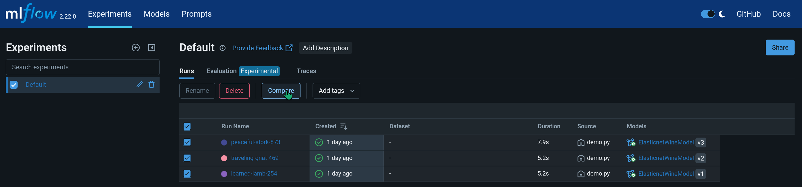
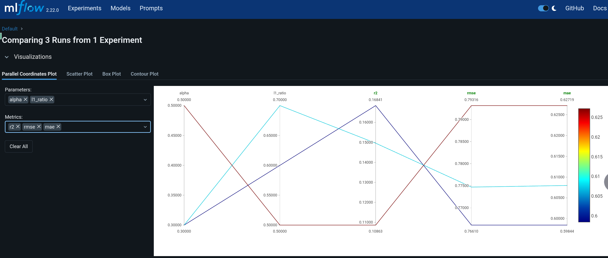
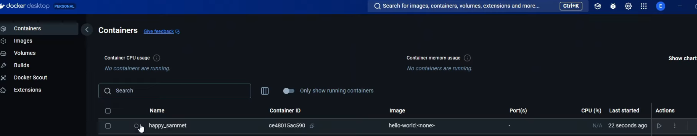
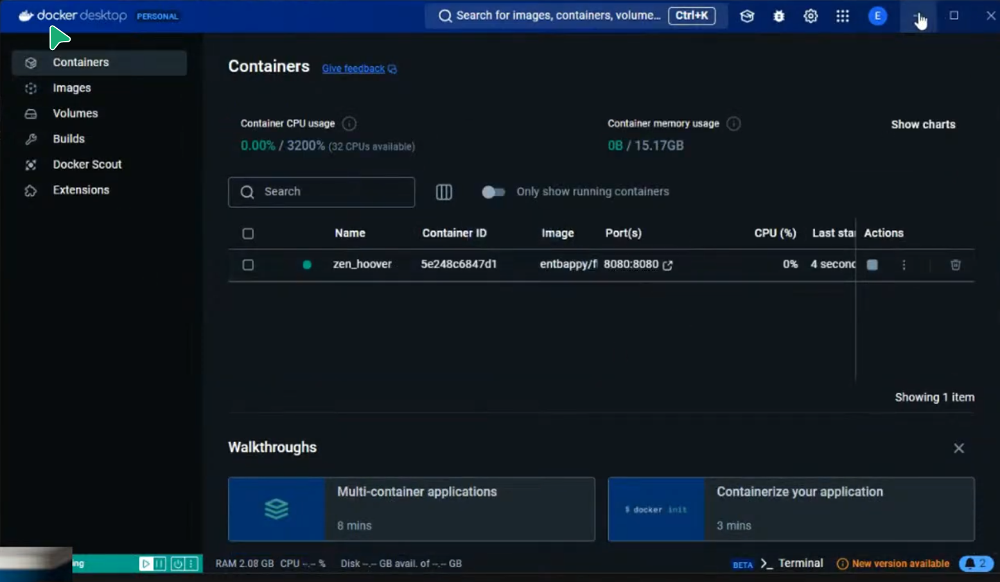

# MLOps-Foundation

* 日期標題後'()' 中為Lecture 實作時的目錄路徑，因此要實作時須先切換到實作目標目錄的路徑，

## Day1 -- Introduction

* [Lecture Video](https://www.youtube.com/watch?v=eRyQDkCrZrk)

* (35:18) MLOPs
  1. Data Management -- DVC
  2. Version Control -- Github
  3. Automation (pipeline) -- Salemaker
  4. Experiment Tracking -- MLflow
  5. CI/CD -- Genkins, CircleCI, Github Action
  6. Monitoring -- Grafana
  7. Retraining -- Airflow

## Day2 (01.Linux cmd)

* [Lecture Video](https://www.youtube.com/watch?v=dfnVzbW423E)

* (3:29)
  - Machine Learning -- Scikit learn
  - Deep Learning -- Tensorflow, Pytorch
  - Generative AI -- LangChine, LlamaIndex

* (07:49)
  Dev -> project -> Deploy (AWS,GCP,AZURE,Alibaba)

* (19:10)
  ```bash
  sudo apt update
  sudo apt-get update -y
  ```

## Day3 (02.Git-Github)

* [Lecture Video](https://www.youtube.com/watch?v=ipVlWGPOijI)

* (11:33)
  <pre>
                  git                                               Github
  Is a version control software                | Is a web application that hosts remote git repo 
  Is used as a command line tool & run locally | Owned by Microsoft. It's running on remote
  </pre>

## Day4 (03.DVC-demo)

* [Lecture Video](https://www.youtube.com/watch?v=pI6r5N7q828)

* ML/DL End-to-end Pipeline
  - Data Ingestion
  - Data Validation
  - Data Transformation
  - Model Training
  - Model Evaluation
  - Prediction Pipeline
  - User Application
  - Deployment

* 執行
  ```bash
  conda create -n mlops python=3.11 -y
  conda activate mlops
  ```

* 建立
  <pre>
  requirements.txt
  </pre>

* 執行 
  ```bash
  pip install -r requirements.txt
  ```

* (18:26) 如果還未啟動 git，要先執行
  ```bash
  git init
  ```

* 建立 
  <pre>
  pipeline/stage_01.py
  pipeline/stage_02.py
  pipeline/stage_03.py
  artifacts/text.txt
  </pre>

* 執行
  ```bash
  python pipeline/stage_01.py
  python pipeline/stage_02.py
  python pipeline/stage_03.py
  ```

* 建立
  <pre>
  main.py
  </pre>

* 執行
  ```bash
  python main.py
  ```

* Nothing has changed

* 建立
  <pre>
  dvc.yaml
  </pre>

* 執行，之後 `.dvc` 資料夾與 `.dvcignore` 檔案 會被建立
  ```bash
  dvc init
  ```

* 執行，之後 `dvc.lock` 會被建立
  ```bash
  dvc repro
  ```

* 此時對 檔案 `artifacts/text.txt` 增減內容後，執行 `dvc repro` 顯示 Stage '...' didn't change

* 刪除檔案 `artifacts/output.txt`，再分別兩次執行，藉此觀察兩次的輸出資訊有何不同
  ```bash
  dvc repro # 執行完後 artifacts/output.txt 會被重新建立
  dvc repro
  ```
  

* 執行
  ```bash
  dvc dag
  ```

## Day5 -- Cloud Platforms

* [Lecture Video](https://www.youtube.com/watch?v=v8RtyRIQoNU)

* GCP
  

* GCP Buckets ~ AWS S3 Bucket

## Day6 (04.MLflow)

* [Lecture Video](https://www.youtube.com/watch?v=Y_BlkXUfkzY)

* Hyperparameter Tuning
  <pre>
  P1 = {learning rate: 0.001, 0.002, 0.003, ...}
  P2 = {optimizer: SGD, Adam, RMSprop}
  </pre>

* 自行執行 `conda create -n chest python=3.11 -y`  (Lecture demo 沒有執行，因已預先建立)

* `conda activate chest`

* 建立 `requirements.txt`
  ```txt
  mlflow==2.2.2
  dagshub
  ```

* `pip install -r requirements.txt`

* [MLflow Python API](https://mlflow.org/docs/latest/api_reference/python_api/index.html#python-api)

* [Red Wine Quality -- Kaggle](https://www.kaggle.com/datasets/uciml/red-wine-quality-cortez-et-al-2009)

* 建立 `demp.py`

* 註冊 dagshub 帳號 [DagsHub](dagshub.com)，後去 'connect a repository'，在 'MLflow Tracking remote' 中得到 url
  

* 執行 `python demo.py`

* 執行 `python demo.py 0.3 0.6`
  
* 執行 `python demo.py 0.3 0.7`

* 在 [dagshub/MLOps-Foundation](dagshub.com/henrykohl/MLOps-Foundation.mlflow/#/experiments) 運行結果列表中(可由上圖中點選 'Go to mlflow UI'進入) ，勾選欲檢視的 experiments 後，執行 'Compare'
  

  > 指定欲比較的 Metrics，即會顯示 experiments 相關結果

  

## Day7 

* [Lecture Video](https://www.youtube.com/watch?v=4HXhYvqOj2Y)

* (21:03) [Install Docker Desktop on Windows](https://docs.docker.com/desktop/setup/install/windows-install/)

* (26:29) [Docker Hub Explore](https://hub.docker.com/explore)

* 執行 
  ```bash
  docker pull hello-world
  docker images
  docker run hello-world
  ```

* Lecture Demo：在 Docker Desktop on Windows 中檢視結果
  


* 執行
  ```bash
  docker ps -a # 複製CONTAINER ID
  docker rm <上面的CONTAINER ID>
  docker ps -a
  docker rmi hello-world
  docker images
  ```

## Containerization - Creating, Tagging, and Managing Custom Docker Images 

* [Lecture Video](https://www.youtube.com/watch?v=5LktCrQIcys)

### Docker-Demo
> * [Github resource -- Ultimate-MLOps-Full-Course](https://github.com/entbappy/Ultimate-MLOps-Full-Course)

* 建立 `Docker-demo` 目錄

* 建立 `Docker-demo/README.md`

* 建立 `Docker-demo/requirements.txt`
  ```txt
  Flask==1.1.2
  Ifaddr=0.1.7
  Itsdangerous==1.1.0
  Jinja2==2.11.2
  MarkupSafe==1.1.1
  Werkzeug==1.0.1
  Zeroconf==0.28.0
  gunicorn==20.1.0
  ```

* 執行
  ```bash
  conda create -n test python=3.11 -y
  conda activate test
  pip install -r requirements.txt
  ```

* 建立 `Docker-demo/calculator.py`

* 執行 `python calculator.py` (輸入 44 與 45)


* 建立資料夾 `Docker-demo/static` 與 `Docker-demo/templates`

* 建立檔案 \
  `Docker-demo/static/main.css` \
  `Docker-demo/static/style.css` \
  `Docker-demo/templates/index.html` \
  `Docker-demo/templates/results.html`

* 執行 `python app.py`  

* 建立 `Docker-demo/Dockerfile`

* 執行 `docker build -t henrykohl/flaskcalapp:latest .` (entbappy 改成 henrykohl)

  - Docker Desktop on Windows 的 images 顯示
  


* 執行 `docker run -p 8080:8080 henrykohl/flaskcalapp:latest` (entbappy 改成 henrykohl)

  - Docker Desktop on Windows 的 containers 顯示
  

* 執行 `docker ps` 可檢視 container 已經運行。按下 Ctrl + C 終止運行 container 

* 再次執行 `docker ps` 可檢視無 container 在運行

* 執行 `docker run -d -p 8080:8080 henrykohl/flaskcalapp:latest` (entbappy 改成 henrykohl)
  > '-d' 表示在後台運行

* 終止 container 運行:
  - Lecture demo 用 Docker Desktop 去 stop 執行中的 container
  - 自行實作時則執行 `docker stop <hash>` ，'<hash>' 是欲刪除終止的 CONTAINER ID

* 刪除 container:
  - 可以在 Docker Desktop 中直接刪除
  - 也可以用指令 `docker rm <hash>` ，'<hash>' 是欲刪除的 CONTAINER ID

* 執行 `docker login`

* 執行 `docker push henrykohl/flaskcalapp:latest`，成功後可以在 Docker Hub 中 repositories 裡找到

* 為了實測當沒有 henrykohl/flaskcalapp:latest 此 image 時執行 docker pull
  - 執行 `docker rmi <hash>` ，'<hash>' 是欲刪除的 IMAGE ID

* 執行 
  ```bash
  docker pull henrykohl/flaskcalapp:latest
  docker run -d -p 8080:8080 henrykohl/flaskcalapp:latest # 開啟 browser (port 為 8080)
  ```

* 注意，實作此章節內容時，需先切換目錄到 Docker-demo，此章節所有 commands 是當 Docker-demo 為根目錄。此外，原Lecture demo 中的 css 路徑有誤，而原目錄 'static' 下沒有 'css' 子目錄，因此自行在 'static' 下再建一子目錄 '/css' 後把 'main.css' 與 'style.css' 檔案移到此子目錄下，另外檔案中 `Docker-demo/templates/results.html` 
  <pre>
  將原本
  href="./style.css"
  改成
  href="./css/style.css" 
  </pre>
  
### End-to-End-Machine-Learning-Pipeline
> * [Github resource](https://github.com/entbappy/End-to-End-Machine-Learning-Pipeline/)

* 執行 `conda create -n mlproj python=3.8 -y`

* 建立 `EtoEMLPipeline/template.py` 

* 執行 `python template.py`，後自動建立 19 個檔案。

- 完成 `EtoEMLPipeline/requirements.txt`

- 完成 `EtoEMLPipeline/setup.py` (注意，此完成後才可執行下一步安裝步驟，因為 'requirements.txt' 包含了 '-e .')

* 執行 `pip install -r requirements.txt` 
  > 完成後為自動建立目錄 `src/mlProject.egg-info`

- 完成 `EtoEMLPipeline/src/mlProject/__init__.py`

* 編撰(暫時地) `EtoEMLPipeline/main.py` 且 執行 `python main.py` 後，除了在 terminal 顯示訊息，還會建立 `logs/running_logs.log`
  ```python
  from mlProject import logger

  logger.info("welcome to mlProject") 
  ```

- 完成 `EtoEMLPipeline/src/mlProject/utils/common.py`

* 建立且完成 `EtoEMLPipeline/research/test.yaml`

* 完成 `EtoEMLPipeline/research/trials.ipynb`

  