# MLOps-Foundation

## ✪ Description

* 日期標題後'()' 中為Lecture 實作時的目錄路徑，因此要實作時須先切換到實作目標目錄的路徑。

* Youtube playist：https://www.youtube.com/watch?v=eRyQDkCrZrk&list=PLkz_y24mlSJbtHxCveCT9NkgYdEhc42il

* Github source：https://github.com/entbappy/MLOps-Foundation

* Day 8(**End-to-End-Machine-Learning-Pipeline**) & Day 9(**Advance ML Pipeline**)
  - Lecture Demo 的 Github source：[End-to-End-Machine-Learning-Pipeline](https://github.com/entbappy/End-to-End-Machine-Learning-Pipeline)
    - 此 Github source 中 AWS-CICD-Deployment-with-Github-Actions 的部分，Lecture Demo 並沒有提到
      - 這部分可以參考 [MLOPs-Production-Ready-Machine-Learning-Project](https://github.com/henrykohl/MLOPs-Production-Ready-Machine-Learning-Project) -- Day 8, 9, 10
      - 要完成 AWS-CICD 還需要完成兩部份：
        1. AWS 設定:
          <pre>
          ✦ 登入 AWS：指定 Region，如 us-east-1
          ✦ 建立 s3 Bucket
          ✦ 建立 IAM 使用者
            ⟡ 綁定 permissions policies
            ⟡ 設定 security credentials:建立 Access key -- 保存 Access key 與 Secret access key
          ✦ 建立 ECR 
            ⟡ 保存 ERC 的 URI
          ✦ 建立 EC2
          ✦ 開啟 EC2 後 安裝 docker:
          ✦ 在 Github 的 Actions/Runners 中設定 New self-hosted runner
            ⟡ 把顯示的指令，也一一複製到 AWS EC2 執行
          ✦ 設定 Github 敏感資訊 (Secrets) 
            ⟡ AWS_ACCESS_KEY_ID
            ⟡ AWS_SECRET_ACCESS_KEY
            ⟡ AWS_DEFAULT_REGION
            ⟡ ECR_REPO (之前保存 ERC 的 URI)
            ⟡ MONGODB_URL (使用於 MongoDB)
          ✦ 設定 AWS EC2 的安全群組 (Security group) -- 定義 inbound rule</pre>
        2. 新增 `End-to-End-Machine-Learning-Pipeline/src/mlProject/components/model_pusher.py`
          


## ✪ Day1 -- Introduction

* [Lecture 1 Video](https://www.youtube.com/watch?v=eRyQDkCrZrk)

* (35:18) MLOPs
  1. Data Management -- DVC
  2. Version Control -- Github
  3. Automation (pipeline) -- Salemaker
  4. Experiment Tracking -- MLflow
  5. CI/CD -- Genkins, CircleCI, Github Action
  6. Monitoring -- Grafana
  7. Retraining -- Airflow

## ✪ Day2 (01.Linux cmd)

* [Lecture 2 Video](https://www.youtube.com/watch?v=dfnVzbW423E)

* (3:29)
  - Machine Learning -- Scikit learn
  - Deep Learning -- Tensorflow, Pytorch
  - Generative AI -- LangChine, LlamaIndex

* (07:49)
  Dev -> project -> Deploy (AWS,GCP,AZURE,Alibaba)

* (19:10)
  ```bash
  sudo apt update
  sudo apt-get update -y
  ```

## ✪ Day3 (02.Git-Github)

* [Lecture 3 Video](https://www.youtube.com/watch?v=ipVlWGPOijI)

* (11:33)
  <pre>
                  git                                               Github
  Is a version control software                | Is a web application that hosts remote git repo 
  Is used as a command line tool & run locally | Owned by Microsoft. It's running on remote
  </pre>

## ✪ Day4 (03.DVC-demo)

* [Lecture 4 Video](https://www.youtube.com/watch?v=pI6r5N7q828)

* ML/DL End-to-end Pipeline
  - Data Ingestion
  - Data Validation
  - Data Transformation
  - Model Training
  - Model Evaluation
  - Prediction Pipeline
  - User Application
  - Deployment

* 執行
  ```bash
  conda create -n mlops python=3.11 -y
  conda activate mlops
  ```

* 建立 `requirements.txt`

* 執行 
  ```bash
  pip install -r requirements.txt
  ```

* (18:26) 如果還未啟動 git，要先執行
  ```bash
  git init
  ```

* 建立 
  <pre>
  pipeline/stage_01.py
  pipeline/stage_02.py
  pipeline/stage_03.py
  artifacts/text.txt
  </pre>

* 執行
  ```bash
  python pipeline/stage_01.py
  python pipeline/stage_02.py
  python pipeline/stage_03.py
  ```

* 建立 `main.py`

* 執行
  ```bash
  python main.py
  ```

* Nothing has changed

* 建立 `dvc.yaml`

* 執行（之後 `.dvc` 資料夾與 `.dvcignore` 檔案 會被建立）
  ```bash
  dvc init
  ```

* 執行（之後 `dvc.lock` 會被建立）
  ```bash
  dvc repro
  ```

* 此時對 檔案 `artifacts/text.txt` 增減內容後，執行 `dvc repro` 顯示 Stage '...' didn't change

* 刪除檔案 `artifacts/output.txt`，再分別兩次執行，藉此觀察兩次的輸出資訊有何不同
  ```bash
  dvc repro # 執行完後 artifacts/output.txt 會被重新建立
  dvc repro
  ```
  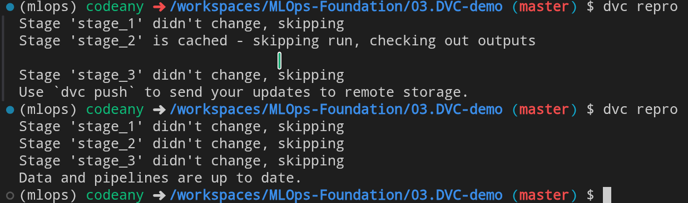

* 執行
  ```bash
  dvc dag
  ```

## ✪ Day5 -- Cloud Platforms

* [Lecture 5 Video](https://www.youtube.com/watch?v=v8RtyRIQoNU)

* GCP
  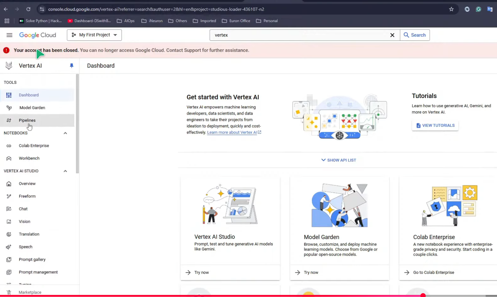

* GCP Buckets ~ AWS S3 Bucket

## ✪ Day6 (04.MLflow)

* [Lecture 6 Video](https://www.youtube.com/watch?v=Y_BlkXUfkzY)

* Hyperparameter Tuning
  <pre>
  P1 = {learning rate: 0.001, 0.002, 0.003, ...}
  P2 = {optimizer: SGD, Adam, RMSprop}
  </pre>

* 自行執行 `conda create -n chest python=3.11 -y`  (Lecture demo 沒有執行，因已預先建立)

* `conda activate chest`

* 建立 `requirements.txt`
  ```txt
  mlflow==2.2.2
  dagshub
  ```

* `pip install -r requirements.txt`

* [MLflow Python API](https://mlflow.org/docs/latest/api_reference/python_api/index.html#python-api)

* [Red Wine Quality -- Kaggle](https://www.kaggle.com/datasets/uciml/red-wine-quality-cortez-et-al-2009)

* 建立 `demp.py`

* 註冊 dagshub 帳號 [DagsHub](dagshub.com)，後去 'connect a repository'，在 'MLflow Tracking remote' 中得到 url
  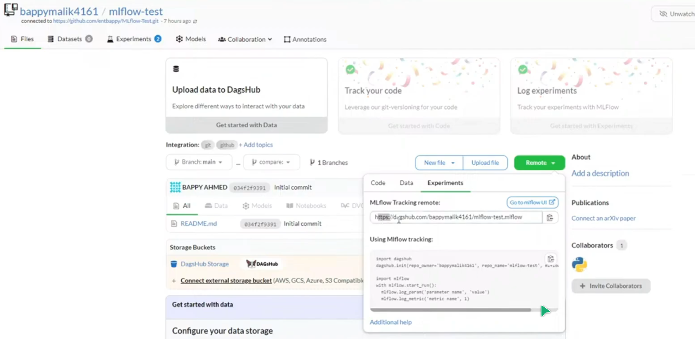

* 執行 `python demo.py`

* 執行 `python demo.py 0.3 0.6`
  
* 執行 `python demo.py 0.3 0.7`

* 在 [dagshub/MLOps-Foundation](dagshub.com/henrykohl/MLOps-Foundation.mlflow/#/experiments) 運行結果列表中(可由上圖中點選 'Go to mlflow UI'進入) ，勾選欲檢視的 experiments 後，執行 'Compare'
  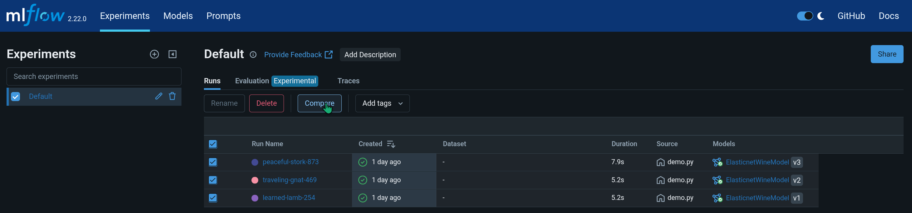

  > 指定欲比較的 Metrics，即會顯示 experiments 相關結果

  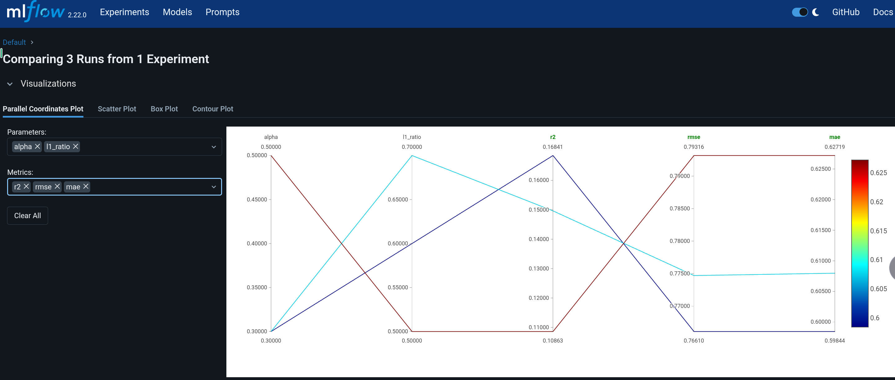

## ✪ Day7 -- Docker for MLOps

* [Lecture 7 Video](https://www.youtube.com/watch?v=4HXhYvqOj2Y)

* (21:03) [Install Docker Desktop on Windows](https://docs.docker.com/desktop/setup/install/windows-install/)

* (26:29) [Docker Hub Explore](https://hub.docker.com/explore)

  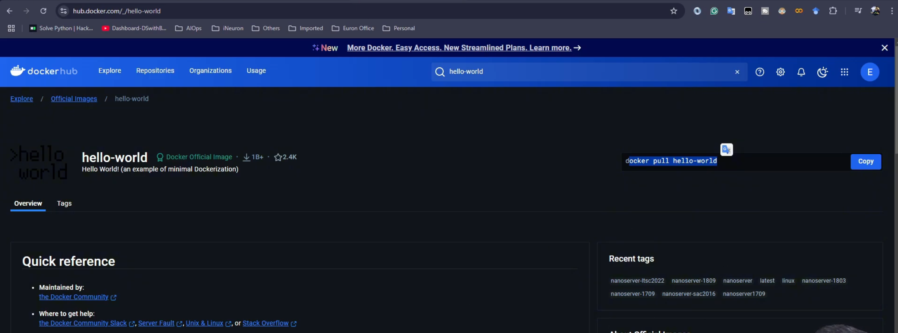<br>
  - 在 DockerHub 搜尋 hello-world

* 開啟 terminal，執行 
  ```bash
  docker pull hello-world
  ```
  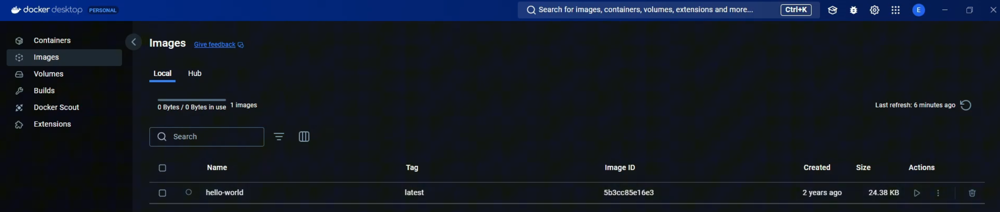<br>
  - hello-world image is pulled inside the Docker Destops (Windows) 

* 執行
  ```bash
  docker images
  docker run hello-world
  ```

  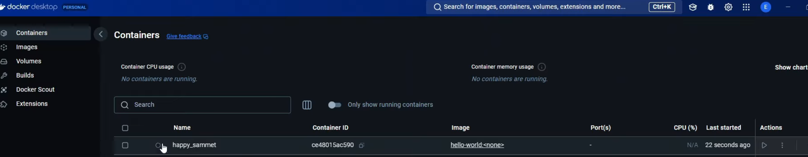
  - 在 Docker Desktop (Windows) 的 Containers 中，有一個 container 已經開始在運行。
  - container 名稱為 'happy_sammet' 是隨機產生的。(每次執行，名稱都可能會不一樣) 


* 執行
  ```bash
  docker ps -a # 複製CONTAINER ID
  docker rm <上面的CONTAINER ID>
  docker ps -a
  docker rmi hello-world
  docker images
  ```

## ✪ Containerization - Creating, Tagging, and Managing Custom Docker Images 

* [Lecture 8 Video](https://www.youtube.com/watch?v=5LktCrQIcys)

* 此 Lecture 包含兩部份 -- Docker-Demo 與 End-to-End-Machine-Learning-Pipeline

### Docker-Demo
> * [Github resource -- Ultimate-MLOps-Full-Course](https://github.com/entbappy/Ultimate-MLOps-Full-Course) -- "Docker/Basic Calculator App"

* 建立 `Docker-demo` 目錄

* 建立 `Docker-demo/README.md`

* 建立 `Docker-demo/requirements.txt`
  ```txt
  Flask==1.1.2
  Ifaddr=0.1.7
  Itsdangerous==1.1.0
  Jinja2==2.11.2
  MarkupSafe==1.1.1
  Werkzeug==1.0.1
  Zeroconf==0.28.0
  gunicorn==20.1.0
  ```

* 執行
  ```bash
  conda create -n test python=3.11 -y
  conda activate test
  pip install -r requirements.txt
  ```

* 建立 `Docker-demo/calculator.py`

* 執行 `python calculator.py` (輸入 44 與 45)


* 建立資料夾 `Docker-demo/static` 與 `Docker-demo/templates`

* 建立檔案 \
  `Docker-demo/static/main.css` \
  `Docker-demo/static/style.css` \
  `Docker-demo/templates/index.html` \
  `Docker-demo/templates/results.html`

* 執行 `python app.py`  

* 建立 `Docker-demo/Dockerfile`

* 執行 `docker build -t henrykohl/flaskcalapp:latest .` (entbappy 改成 henrykohl)

  - Docker Desktop on Windows 的 images 顯示
  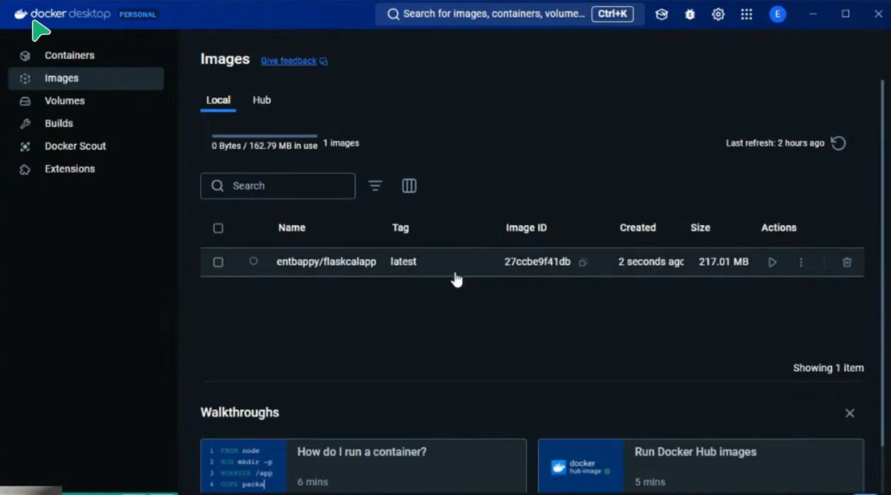


* 執行 `docker run -p 8080:8080 henrykohl/flaskcalapp:latest` (entbappy 改成 henrykohl)

  - Docker Desktop on Windows 的 containers 顯示
  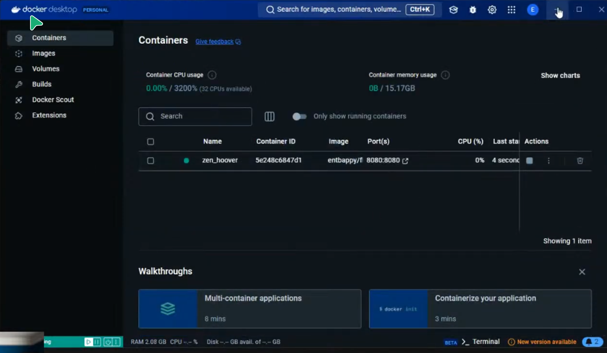

* 執行 `docker ps` 可檢視 container 已經運行。按下 Ctrl + C 終止運行 container 

* 再次執行 `docker ps` 可檢視無 container 在運行

* 執行 `docker run -d -p 8080:8080 henrykohl/flaskcalapp:latest` (entbappy 改成 henrykohl)
  > '-d' 表示在後台運行

* 終止 container 運行:
  - Lecture demo 用 Docker Desktop 去 stop 執行中的 container
  - 自行實作時則執行 `docker stop <hash>` ，'<hash>' 是欲刪除終止的 CONTAINER ID

* 刪除 container:
  - 可以在 Docker Desktop 中直接刪除
  - 也可以用指令 `docker rm <hash>` ，'<hash>' 是欲刪除的 CONTAINER ID

* 執行 `docker login`

* 執行 `docker push henrykohl/flaskcalapp:latest`，成功後可以在 Docker Hub 中 repositories 裡找到

* 為了實測當沒有 henrykohl/flaskcalapp:latest 此 image 時執行 docker pull
  - 執行 `docker rmi <hash>` ，'<hash>' 是欲刪除的 IMAGE ID

* 執行 
  ```bash
  docker pull henrykohl/flaskcalapp:latest
  docker run -d -p 8080:8080 henrykohl/flaskcalapp:latest # 開啟 browser (port 為 8080)
  ```

* 注意，實作此章節內容時，需先切換目錄到 Docker-demo，此章節所有 commands 是當 Docker-demo 為根目錄。此外，原Lecture demo 中的 css 路徑有誤，而原目錄 'static' 下沒有 'css' 子目錄，因此自行在 'static' 下再建一子目錄 '/css' 後把 'main.css' 與 'style.css' 檔案移到此子目錄下，另外檔案中 `Docker-demo/templates/results.html` 
  <pre>
  將原本
  href="./style.css"
  改成
  href="./css/style.css" 
  </pre>
  
### End-to-End-Machine-Learning-Pipeline
> * (1:00:50) Github resource：[End-to-End-Machine-Learning-Pipeline](https://github.com/entbappy/End-to-End-Machine-Learning-Pipeline/)

* 此專案實做都在目錄 **`/End-to-End-Machine-Learning-Pipeline`** 之下，以下此講筆記的路徑均以為此根目錄

* 執行 `conda create -n mlproj python=3.8 -y` 和 `conda activate mlproj`

* (1:17:50) 建立 `template.py` 

* (1:28:30) 執行 `python template.py`，後自動建立 19 個檔案。

* (1:30:50) Git commit ("folder structure added")

- 完成 `requirements.txt`

- 完成 `setup.py` (注意，此完成後才可執行下一步安裝步驟，因為 'requirements.txt' 包含了 '-e .')
  - 這是一個標準的 Python 專案安裝設定檔。它的核心目的是定義如何打包程式碼，並告訴 Python 哪些目錄應該被視為「套件 (packages)」。

* 執行 `pip install -r requirements.txt` 
  > 完成後為自動建立目錄 `src/mlProject.egg-info`

* (1:35:40) Git commit ('requirements added')

- (1:39:30) 完成 `src/mlProject/__init__.py`
  - 如果專案是個複雜的 Package，可以把所有的 logging 設定（如日誌格式 Formatter、輸出頻道 Handler、日誌等級 Level）寫在此檔案中。這樣只要其他模組導入了這個 Package，就會套用這些設定，避免重複配置。

* (1:40:10) 編撰(暫時地) `main.py`
  ```python
  from mlProject import logger

  logger.info("welcome to mlProject") 
  ```

* (1:41:25) 執行 `python main.py` 後，除了在 terminal 顯示訊息，還會建立 `logs/running_logs.log`

- 完成 `src/mlProject/utils/common.py` (主要有六個功能函數)
  - read_yaml: 讀取 yaml 檔案
  - create_directories: 建立(多)目錄
  - save_json: JSON 物件存到檔案
  - load_json: 讀取檔案為 JSON 物件
  - save_bin:  物件存到檔案
  - load_bin:  讀取檔案為物件
  - get_size:  獲得物件大小（kb）

* 建立且完成 `research/test.yaml`

* 完成 `research/trials.ipynb`
  - 練習 ConfigBox 與 ensure_annotations

* **下一講章節，繼續未完成部分！**

## ✪ Advance ML Pipeline 

* [Lecture 9 Video](https://www.youtube.com/watch?v=TZrJNkZCxaU)

* 此講的實做都在目錄 **`/End-to-End-Machine-Learning-Pipeline`** 之下，以下此講筆記的路徑均以為此根目錄

* 下載訓練資料後，存成 `data/winequality-red.csv`
  > [Kaggle: Red Wine Quality](https://www.kaggle.com/datasets/uciml/red-wine-quality-cortez-et-al-2009)

---

* 建立完成 `research/Experiment.ipynb`

* ML Pipeline
  1. Data Ingestion --> DB, Github
  2. Data Validation
  3. Data Transformation --> Feature Engineering, EDA
  4. Model Trainer --> Model.pkl, Joblib
  5. Model Evaluation --> RMSE, R2, MAE
  6. Model Pusher --> S3

---

### Data Ingestion

* 建立完成 `research/01_data_ingestion.ipynb`

#### 1. Update `config.yaml`

* 完成 `config/config.yaml` ('data_ingestion' 那部分)
  > - 取代 [原 source URL](https://github.com/entbappy/Branching-tutorial/raw/master/winequality-data.zip)
  > - 換成 [新 source URL](https://github.com/henrykohl/MLOps-Foundation/raw/main/End-to-End-Machine-Learning-Pipeline/winequality-data.zip) -- 自行把 data 存留一份 

#### 2. Update `schema.yaml`

* 完成 `schema.yaml`
  - 用以讀取資料 winequality-data 後，資料(DataFrame)的各欄位名稱

#### 3. Update `params.yaml`

* 完成 `params.yaml`
  - 定義將使用的模型 ElasticNet 的參數

* 完成 `src/mlProject/constants/__init__.py`
  - 定義三個 yaml 檔案路徑的變數："config/config.yaml"，"params.yaml"，"schema.yaml"

* (53:19) 執行 `research/01_data_ingestion.ipynb` 完後，會建立 `artifacts/data_ingestion` 資料夾內包含 'data.zip' 與 'winequality-red.csv' 兩個檔案

#### 4. Update the entity

* (55:14) 完成 `src/mlProject/entity/config_entity.py` (data_ingestion 那部分)

#### 5. Update the configuration manager in src config

* (55:38) 完成 `src/mlProject/config/configuration.py` (data_ingestion 那部分)
  <pre>
  ➤ 建立目錄 `artifacts`
  ■ get_data_ingestion_config() -- 1.2.</pre>
  1. 建立 data_ingestion 目錄於根目錄之下
  2. 建立 DataIngestionConfig 類實例，並回傳此類實例
    - 輸入 data_ingestion 的根目錄
    - 輸入 資料來源 URL
    - 輸入 本地端資料存檔路徑
    - 輸入 資料檔案解壓路徑

#### 6. update the components

* (56:30) 建立完成 `src/mlProject/components/data_ingestion.py`
  <pre>
  ➤ 輸入 DataIngestionConfig 類實例
  ■ download_file() -- 1.
  ■ extract_zip_file() -- 2.</pre>
  1. 下載 資料 zip 檔案
  2. 解壓 資料 zip 檔案

#### 7. updated the pipeline

* (57:50) 建立完成 `src/mlProject/pipeline/stage_01_data_ingestion.py`
  1. 獲得 ConfigurationManager 類實例
  2. 獲得 DataIngestionConfig 類實例
  3. 獲得 DataIngestion 類實例
  4. 下載 資料 zip 檔案
  5. 解壓 資料 zip 檔案 

#### 8. Update the `main.py`

* (1:00:00) 完成 `main.py` (data_ingestion 那部分)

* 執行 `python main.py` (執行前將 `artifacts` 資料夾刪除)完後，
  > 會建立 `artifacts/data_ingestion` 資料夾內包含 'data.zip' 與 'winequality-red.csv' 兩個檔案

* 在 `.gitignore` 中加入 (此檔案要新建，而 repository 根目錄有另一個 '.gitignore' )
  ```.gitignore
  artifacts/*
  ```

* (1:02:25) git commit ('data ingestion added')

---


### Data Validation

* (1:03:32) 建立完成 `research/02_data_validation.ipynb`

#### 1. Update `config.yaml

* 完成 `config/config.yaml` ('data_validation' 那部分)

#### 2. Update `schema.yaml`

* 不變

#### 3. Update `params.yaml`

* 不變

* (1:09:39) 執行 `research/02_data_validation.ipynb` 
  > - 全部執行完後，會建立 `artifacts/data_validation` 資料夾內包含 'status.txt'
  > - 若 `artifacts/data/winequality-red.csv` 中的資料有 column 缺失，'status.txt' 中會記錄 'False' 

####  4. Update the entity

* (1:11:33) 完成 `src/mlProject/entity/config_entity.py` (data_validation 那部分)

#### 5. Update the configuration manager in src config

* (1:12:22) 完成 `src/mlProject/config/configuration.py` (data_validation 那部分)
  <pre>
  ➤ 建立根目錄 `artifacts`
  ■ get_data_validation_config() -- 1.2.</pre>
  1. 建立 data_validation 目錄於根目錄之下
  2. 建立 DataValidationConfig 類實例，並回傳此類實例
    - 輸入 data_validation 的根目錄
    - 輸入 狀態檔案路徑
    - 輸入 解壓資料檔案路徑
    - 輸入 全綱要 -- ConfigBox 類

#### 6. update the components

* (1:12:59) 建立完成 `src/mlProject/components/data_validation.py`
  <pre>
  ➤ 輸入 DataValidationConfig 類實例
  ■ validate_all_columns() -- 1. ~ 4.</pre>
  1. 從解壓資料檔案路徑讀取為 dataframe 數據
  2. 獲得 dataframe 數據的 column 名稱列表
  3. 獲得 全綱要的 key 名稱列表
  4. 建立 驗證狀態布林值，並回傳且存入檔案中
    - column 名稱列表 與 key 名稱列表，全部相符為真，否則為否


#### 7. updated the pipeline

* (1:14:05) 建立完成 `src/mlProject/pipeline/stage_02_data_validation.py`
  1. 獲得 ConfigurationManager 類實例
  2. 獲得 DataValidationConfig 類實例
  3. 獲得 DataValidation 類實例
  4. 建立 驗證狀態布林值，並存入檔案中

#### 8. Update the `main.py`

* (1:14:30) 完成 `main.py` (data_validation 那部分)

* 執行 `python main.py` (執行前將 `artifacts` 資料夾刪除)完後，
  > - 會建立 `artifacts/data_ingestion` 資料夾內包含 'data.zip' 與 'winequality-red.csv' 兩個檔案 \
  > - 會建立 `artifacts/data_validation` 資料夾內包含 'status.txt'

---
(1:18:35)

### Data Transformation

* 建立完成 `research/03_data_transformation.ipynb`

#### 1. Update `config.yaml`

* 完成 `config/config.yaml` ('data_transformation' 那部分)

#### 2. Update `schema.yaml`

* 不變

#### 3. Update `params.yaml`

* 不變

* (1:21:45) 執行 `research/03_data_transformation.ipynb` 完後，會建立 `artifacts/data_transformation` 資料夾內包含 'train.csv' 與 'test.csv'

####  4. Update the entity

* (1:22:18) 完成 `src/mlProject/entity/config_entity.py` (data_transformation 那部分)

#### 5. Update the configuration manager in src config

* (1:22:33) 完成 `src/mlProject/config/configuration.py` (data_transformation 那部分)
  <pre>
  ➤ 建立目錄 `artifacts`
  ■ get_data_transformation_config() -- 1.2.</pre>
  1. 建立 data_transformation 目錄於根目錄之下
  2. 建立 DataTransformationConfig 類實例，並回傳此類實例
    - 輸入 data_transformation 的根目錄
    - 輸入 本地端資料存檔路徑

#### 6. update the components

* (1:23:07) 建立完成 `src/mlProject/components/data_transformation.py`
  <pre>
  ➤ 輸入 DataTransformationConfig 類實例
  ■ train_test_spliting() -- </pre>
  1. 從解壓資料檔案路徑讀取為 dataframe 數據
  

#### 7. updated the pipeline

* (1:23:58) 建立完成 `src/mlProject/pipeline/stage_03_data_transformation.py`

#### 8. Update the `main.py`

* (1:25:30) 完成 `main.py` (data_transformation 那部分)

* 執行 `python main.py` (執行前將 `artifacts` 資料夾刪除)完後，
  > 會建立 `artifacts/data_ingestion` 資料夾內包含 'data.zip' 與 'winequality-red.csv' 兩個檔案 \
  > 會建立 `artifacts/data_validation` 資料夾內包含 'status.txt' \
  > 會建立 `artifacts/data_transformation` 資料夾內包含 'train.csv' 與 'test.csv' 

---

### Model Trainer

* 建立完成 `research/04_model_trainer.ipynb` 

#### 1. Update `config.yaml`

* 完成 `config/config.yaml` ('data_transformation' 那部分)

#### 2. Update `schema.yaml`

* 不變

#### 3. Update `params.yaml`

* 不變

* (1:44:45) 執行 `research/04_model_trainer.ipynb` 完後，會建立 `artifacts/model_trainer` 資料夾內包含 'model.joblib'

####  4. Update the entity

* (1:35:00) 完成 `src/mlProject/entity/config_entity.py` (model_trainer 那部分)

#### 5. Update the configuration manager in src config

* (1:35:15) 完成 `src/mlProject/config/configuration.py` (model_trainer 那部分)

#### 6. update the components

* (1:35:45) 建立完成 `src/mlProject/components/model_trainer.py`

#### 7. updated the pipeline

* (1:36:25) 建立完成 `src/mlProject/pipeline/stage_04_model_trainer.py`

#### 8. Update the `main.py`

* (1:37:10) 完成 `main.py` (model_trainer 那部分)

* 執行 `python main.py` (執行前將 `artifacts` 資料夾刪除)完後，
  > 會建立 `artifacts/data_ingestion` 資料夾內包含 'data.zip' 與 'winequality-red.csv' 兩個檔案 \
  > 會建立 `artifacts/data_validation` 資料夾內包含 'status.txt' \
  > 會建立 `artifacts/data_transformation` 資料夾內包含 'train.csv' 與 'test.csv' \
  > 會建立 `artifacts/model_trainer` 資料夾內包含 'model.joblib'

---

### Model Evaluation

* (1:37:50) 建立完成 `research/05_model_evaluation.ipynb` 

#### 1. Update config.yaml

* 完成 `config/config.yaml` ('model_evaluation' 那部分)

#### 2. Update schema.yaml

* 不變

#### 3. Update params.yaml

* 不變

* (1:39:25) 執行 `research/05_model_evaluation.ipynb` 完後，會建立 `artifacts/model_evaluation` 資料夾內包含 'metrics.json'

####  4. Update the entity

* (1:39:38) 完成 `src/mlProject/entity/config_entity.py` (model_evaluation 那部分)

#### 5. Update the configuration manager in src config

* (1:40:00) 完成 `src/mlProject/config/configuration.py` (model_evaluation 那部分)

#### 6. update the components

* (1:40:30) 建立完成 `src/mlProject/components/model_evaluation.py`

#### 7. updated the pipeline

* (1:41:36) 建立完成 `src/mlProject/pipeline/stage_05_model_evaluation.py`

#### 8. Update the `main.py`

* (1:41:55) 完成 `main.py` (model_evaluation 那部分)

* 執行 `python main.py` (執行前將 `artifacts` 資料夾刪除)完後，
  > 會建立 `artifacts/data_ingestion` 資料夾內包含 'data.zip' 與 'winequality-red.csv' 兩個檔案 \
  > 會建立 `artifacts/data_validation` 資料夾內包含 'status.txt' \
  > 會建立 `artifacts/data_transformation` 資料夾內包含 'train.csv' 與 'test.csv' \
  > 會建立 `artifacts/model_trainer` 資料夾內包含 'model.joblib' \
  > 會建立 `artifacts/model_evaluation` 資料夾內包含 'metrics.json' 

### Prediction

* (1:44:45) 建立完成 `src/mlProject/pipeline/prediction.py`

### User Interface

* (1:45:02) 完成 `app.py`

* 完成 `templates/index.html` （Lecture demo 略過內容細節）

* 建立完成 `templates/results.html` （Lecture demo 略過內容細節）

* 建立 `static` 資料夾，放置相關 'css' 檔案與圖片 （Lecture demo 略過內容細節）

* (1:47:34) 執行 `python app.py`

* 開啟 browser 輸入網址 `localhost:8080` (測試頁面畫面)

* 開啟 browser 輸入網址 `localhost:8080/train` 

* 開啟 browser 輸入網址 `localhost:8080` 輸入相關參數按下 'predict' (測試功能)

  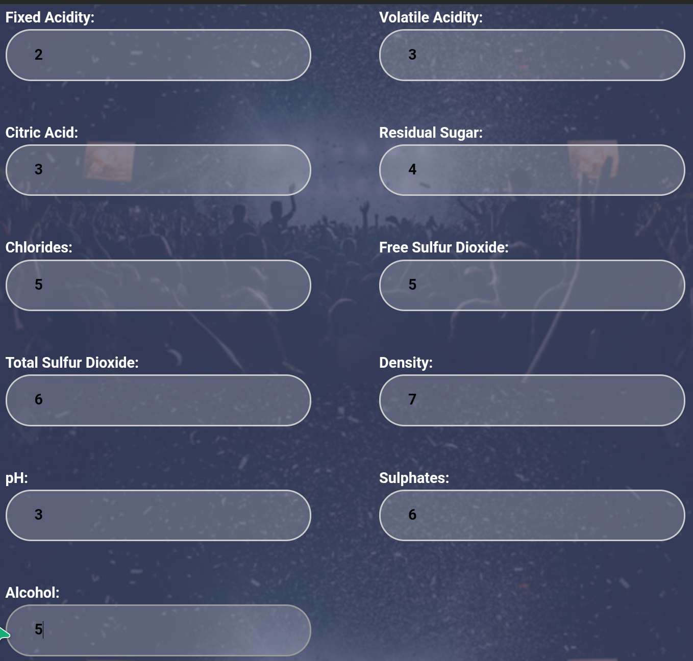

* (1:52:10) Git commit ('completed till app')

## ✪ End-to-End Machine Learning Project Using AWS SageMaker

* [Lecture 10 Video](https://www.youtube.com/watch?v=7dksopxbcqM)

* (1:28) Login AWS，設定 AWS

  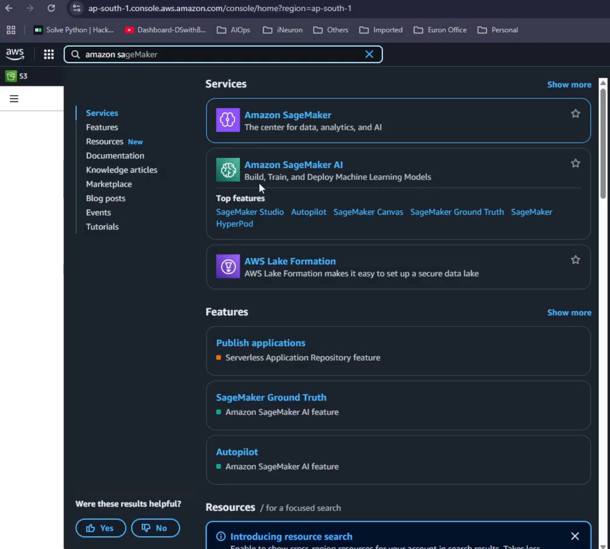<br>
  - 點選 Amazon Segamaker AI

  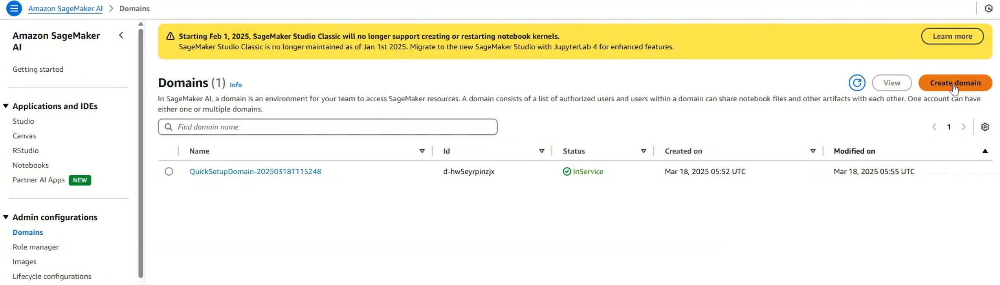<br>
  - 在 Domains 中點選 Create domain

  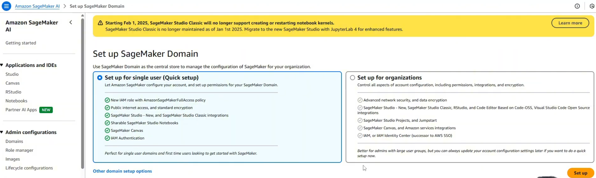<br>
  - 建立 domain，按下 Set up (若尚未建立 domain)
  - 回到上個畫面，點選已建立的 domain

  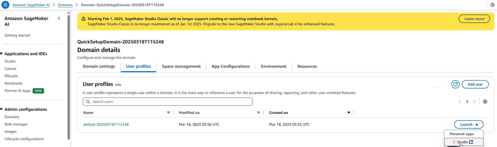<br>
  - 切換到 User profiles 頁面
  - 如果尚未建立(或要建立多個) profile，點選 Add user
  -按下 Launch，點選 Studio

  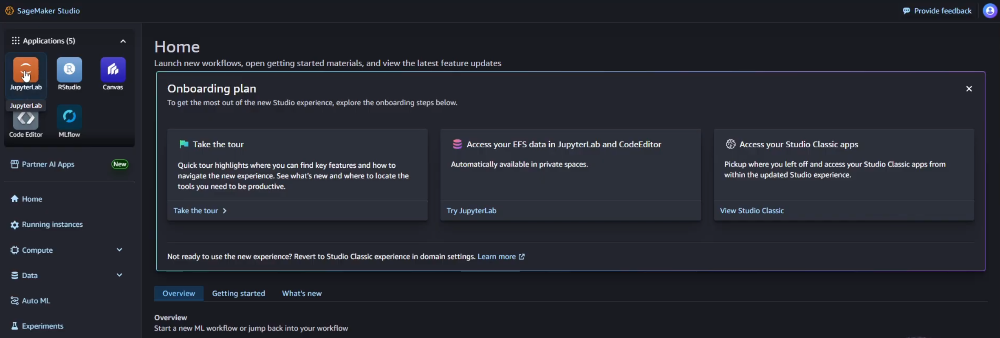<br>
  - 在 Applications 欄中，點選 JupyterLab

  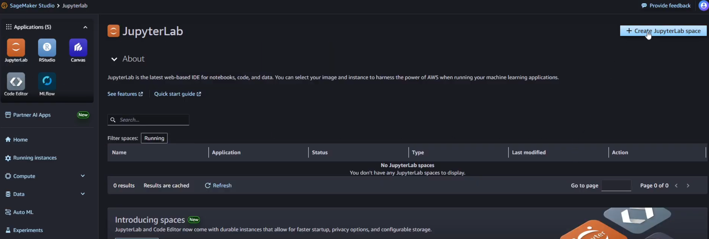<br>
  - 點選 Create JupyterLab space

  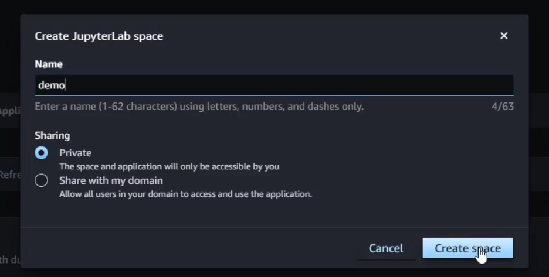<br>
  - Name：demo
  - 點選 Create space

  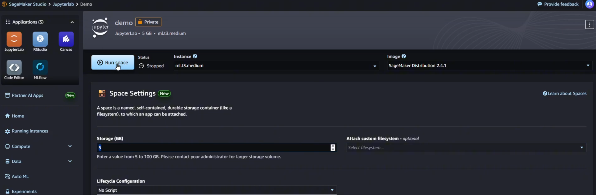<br>
  - 點選 Run space

  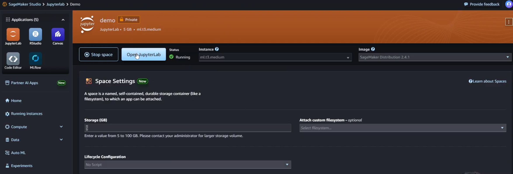<br>
  - 點選 Open JupyterLab -- launch the jupyter lab

  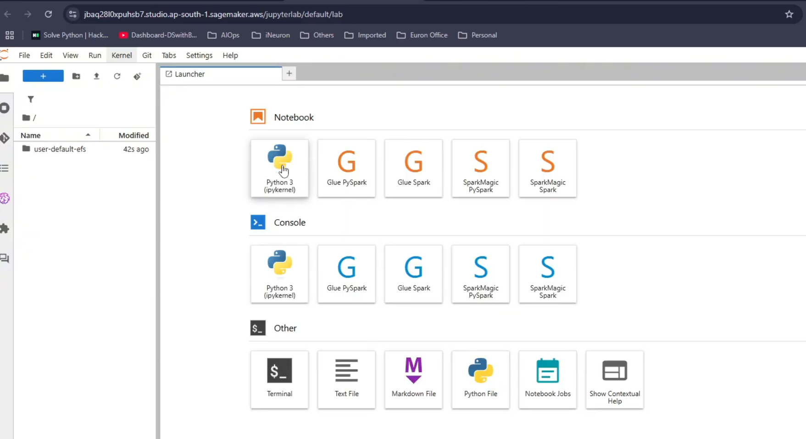<br>
  - 點選 Python 3

  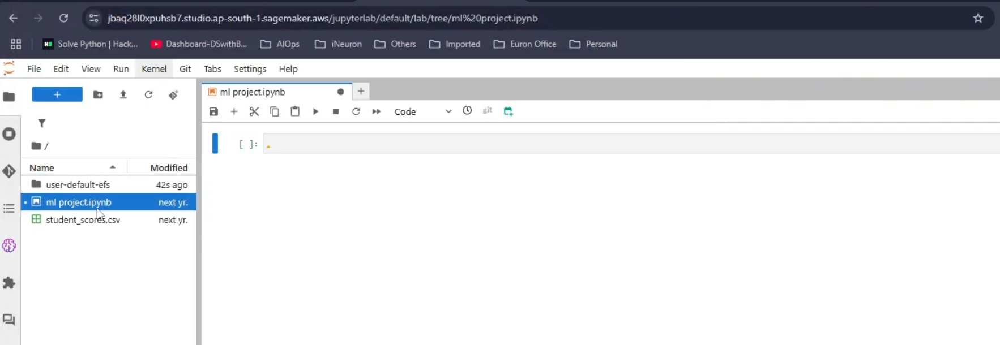<br>
  - JupyterNotebook 頁面，將 ipynb 檔案名改為 'ml project'
  - 將 'student_scores.csv' 上傳 (檔案來源，見下一說明) 


* (5:54) kaggle -- [Kamlesh/student_scores](https://www.kaggle.com/datasets/kamleshsam/student-scores)
  - 下載檔案 'student_scores.csv' （置放於 `10.Segamaker` 資料夾） 

* 完成 `10.Segamaker/ml project.ipynb` (實際執行必須在 AWS Sagemaker 環境下)
  - Lecture demo 內容與說明，都紀錄與標註於此檔案中。

## ✪ Deploy Your Machine Learning Pipeline Using Docker & Kubernetes

* [Lecture 11 Video](https://www.youtube.com/watch?v=67BT4lRyeXI)

* 登入 Google Could Platform

* (3:51) [Github -- pycaret-deployment-google](https://github.com/pycaret/pycaret-deployment-google)

* (6:30) GCP 搜尋 'Container Registry'

  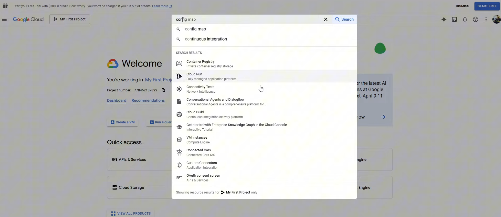<br>
  - 在搜尋頁面輸入 "con..." 點選 'Container Registry'，

  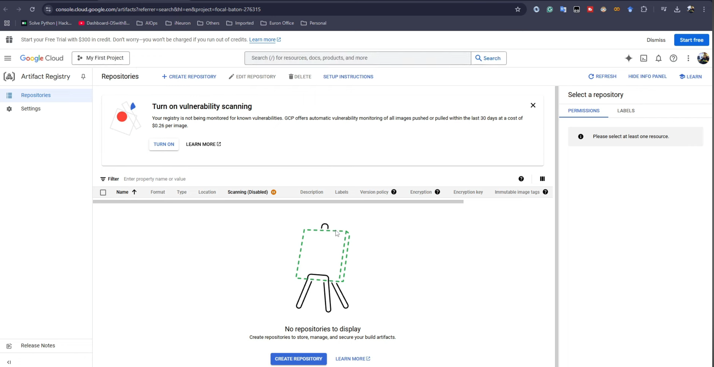<br>
  - 顯示 Repositories 頁面

* (7:14) GCP 搜尋 'Kubernetes Engine'

  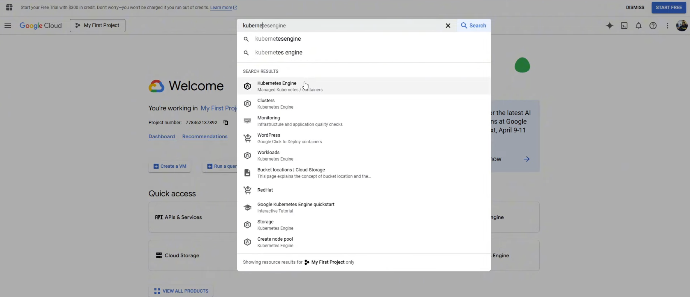<br>
  - 在搜尋頁面輸入 "kubernet..." 點選 'Kubernetes Engine'，

  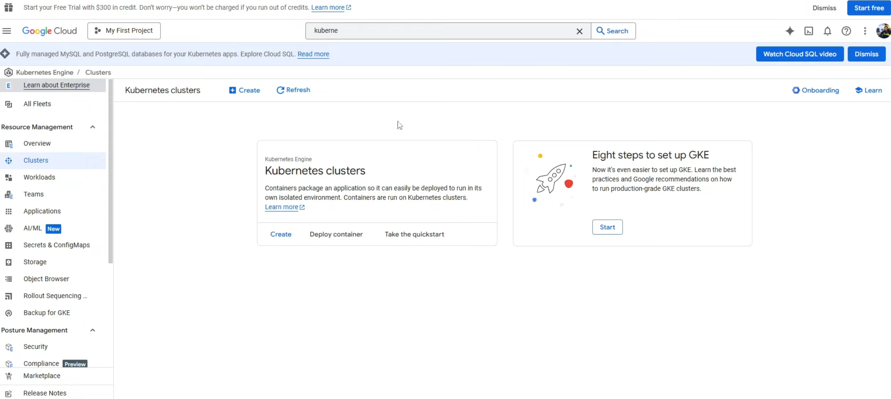<br>
  - 顯示 Kubernetes Engine 的 Clusters 頁面

* (7:50) GCP 首頁

  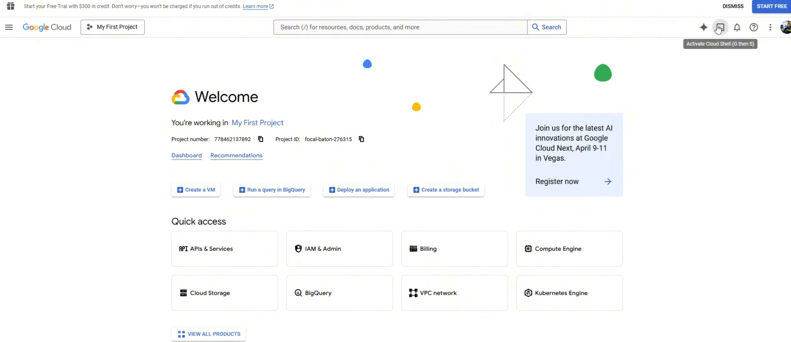<br>
  - 點選 Activate Cloud Shell (G then S)

* 之後接續要在 shell 上執行的命令 (9:40)

  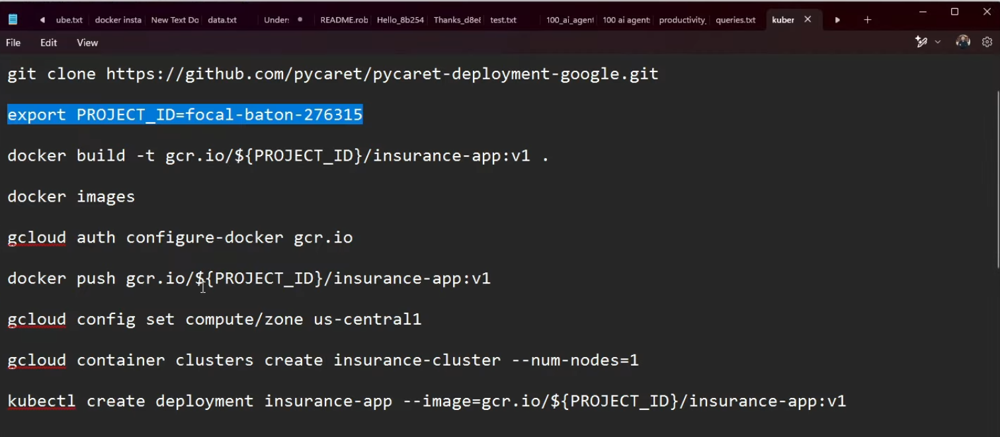


* (9:10) GCP shell

  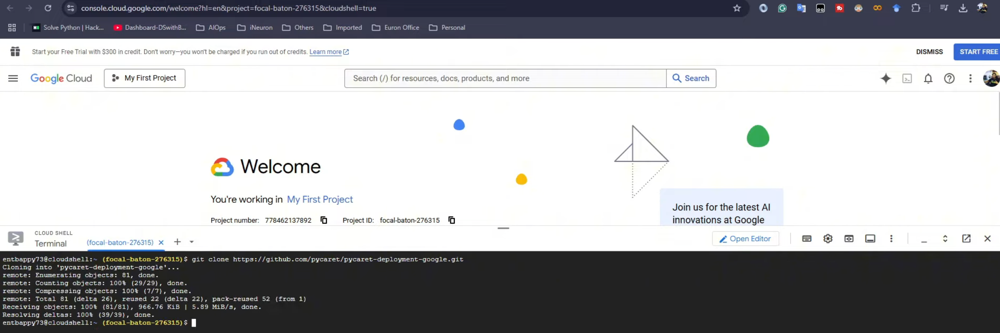<br>
  - 執行 `git clone https://github.com/pycaret/pycaret-deployment-google.git`

  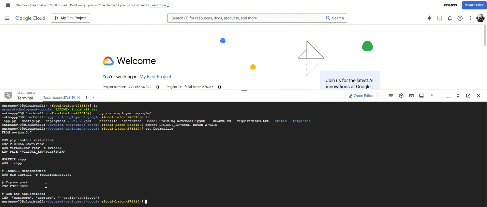<br>
  - 執行 `ls`
  - 執行 `cd pycaret-deployment-google/`
  - 執行 `ls`
  - 執行 `EXPORT PROJECT_ID=focal-baton-276315` (宣告並匯出變數 PROJECT_ID)
  - 執行 `cat Dockerfile` （檢視 Dockerfile）

* (10:09 補充) 找到 PROJECT_ID

  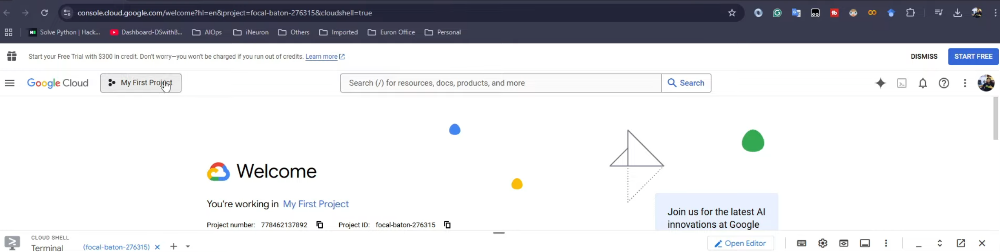<br>
  - step 1: 點選 My First Project

  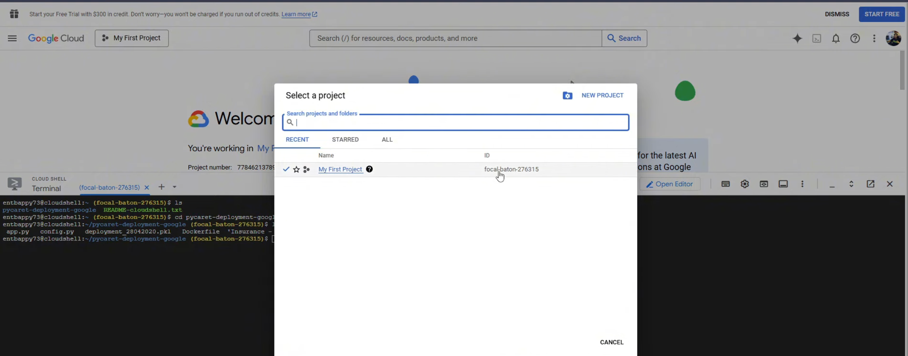<br>
  - step 2: 找到專案名稱，即可找出對應的 ID

* (12:21) GCP shell

  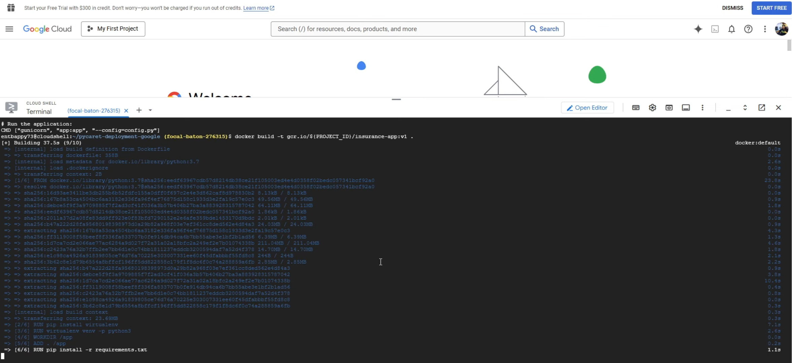<br>
  - 執行 `docker build -t gcr.io/${PROJECT_ID}/insurance-app:v1 .`
    <pre>
    ✦ docker build：這是 Docker 的核心指令，告訴電腦根據專案夾中的 Dockerfile 設定檔，自動建立一個映像檔。
    ✦ -t (tag)：這個參數是用來給映像檔取名字和打標籤的。
    ✦ gcr.io/focal-baton-276315/insurance-app:v1：這是完整的映像檔名稱。
      ⟡ gcr.io：目標存放位置（Google 的容器註冊表）。
      ⟡ focal-baton-276315：你在 Google Cloud 上的專案 ID。
      ⟡ insurance-app：這個應用程式的名稱。
      ⟡ :v1：版本號標籤，方便你區分不同時期的程式。
      ⟡ . (最後那個點)：這非常重要，代表「在當前路徑」尋找 Dockerfile。
    </pre>
  - (13:14) Lecture demo 出現錯誤，原因是 python 過舊，解決方式見後～

  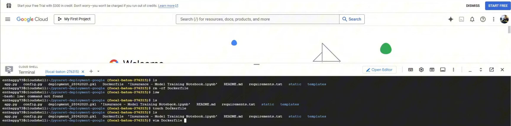<br>
  - 刪除原本 Dockerfile，再建立新的 Dockerfile

* (14:33) 建立新的 `Dockerfile`
  ```dockerfile
  FROM python:3.9

  RUN pip install virtualenv
  ENV VIRTUAL_ENV=/venv
  RUN virtualenv $VIRTUAL_ENV -p python3
  ENV PATH="$VIRTUAL_ENV/bin:$PATH"

  WORKDIR /app
  ADD . /app

  # Install dependencies
  RUN pip install -r requirements.txt

  # Expose port
  ENV PORT=8080

  # Run the application
  CMD ["gunicorn","app:app","--config=config.py"]
  ```
* 再次執行 `docker build -t gcr.io/${PROJECT_ID}/insurance-app:v1 .`，但還會有一個錯誤。
  - 原因是 requirements.txt 中 pycaret 的版本已不被支援


* (16:50) 修改 requirements.txt，針對 pycaret

  ```txt
  pycaret # pycaret==1.0.0
  Flask==1.1.1
  Jinja2==2.10.1
  gunicorn==19.9.0
  certifi==2019.11.28
  itsdangerous==1.1.0
  ```

* (16:55 - 18:40) GCP shell
  
  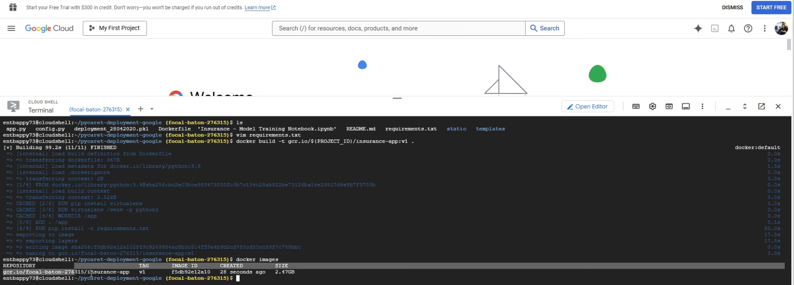<br>
  - 再次執行 `docker build -t gcr.io/${PROJECT_ID}/insurance-app:v1 .`
  - 然後執行 `docker images`

  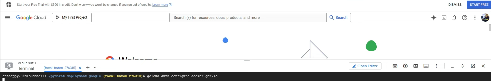<br>
  - 執行 `gloud auth configure-docker gcr.io` (設定 Docker 使用 gcloud 作為憑證輔助工具)
    <pre>
    ✦ gcloud auth：使用 Google Cloud SDK 的身分驗證相關功能。
    ✦ configure-docker：修改 Docker 的設定檔（通常是 ~/.docker/config.json），將 Google 的註冊表地址加入其中。
    ✦ gcr.io：指定要授權的目標網域。gcr.io 是 Google Container Registry 的主要位址。
    </pre>
    - 之後執行 `docker push gcr.io/...` 或 `docker pull gcr.io/...` 時，Docker 會自動跟 gcloud 要權限，不會再跳出「Access Denied」或要求輸入密碼。

  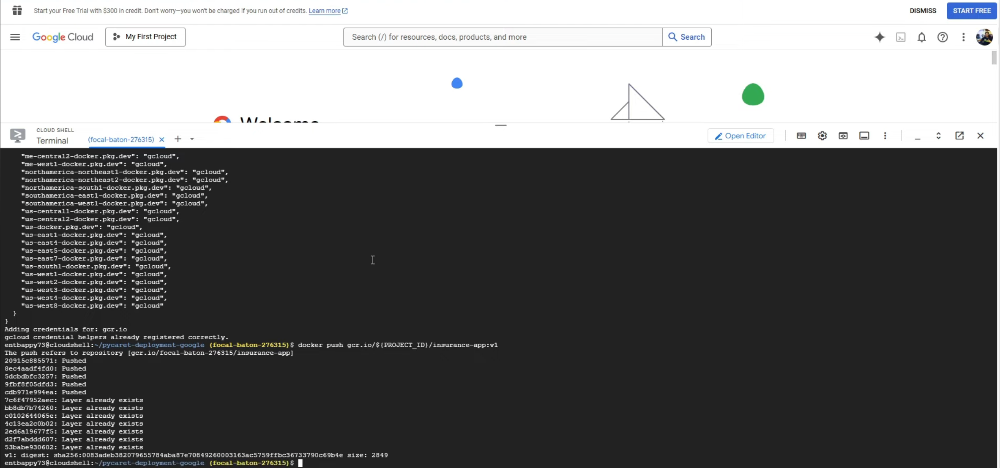<br>
  - 執行 `docker push gcr.io/${PROJECT_ID}/insurance-app:v1` (上傳程式)
    - 將剛才在本地打包好的映像檔，正式上傳到 Google Cloud 的雲端倉庫（GCR）
    <pre>
    ✦ docker push：上傳指令，會將本地磁碟中的映像檔傳送到遠端伺服器。
    ✦ gcr.io/focal-baton-276315/insurance-app:v1：這是包裹的「完整收件地址」。
      ⟡ 上傳到 Google Container Registry (gcr.io)。
      ⟡ 存放在專案 focal-baton-276315 之下。
      ⟡ 這個檔案夾叫 insurance-app，版本標籤是 v1。
    </pre>

* (21:17) GCP 頁面

  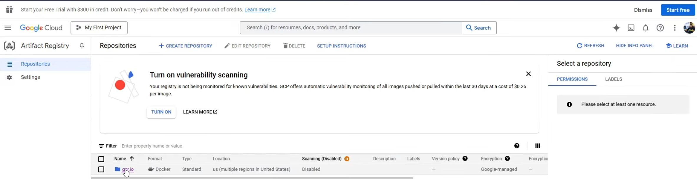<br>
  - 在 Repositories 頁面，點選 gcr.io 資料夾

  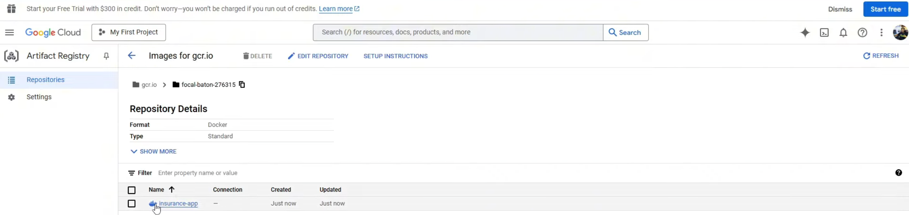<br>
  - 在專案目錄中，點選 insurance-app

  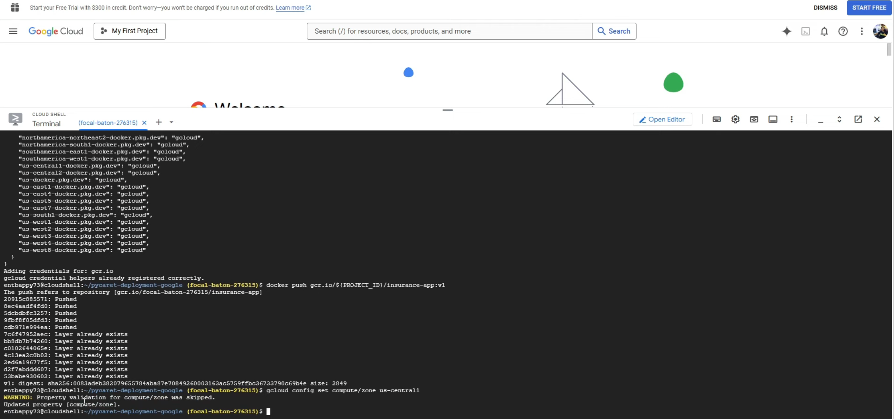<br>
  - 執行 `gloud config set compute/zone us-central1` (將 Google Cloud CLI (gcloud) 的預設雲端運算區域（Zone）設定為 us-central1)
  <pre>
  ✦ gcloud config set：這是修改 gcloud 工具個人設定檔的指令。
  ✦ compute/zone：這是一個特定的設定項，專指 Google Compute Engine (GCE) 資源所在的「具體機房位置」。
  ✦ us-central1：這是目標區域的名稱。
    ⟡ us-central 代表美國中部。
    ⟡ 1 代表該區域內的特定區域（通常還有 us-central1-a, us-central1-b 等，如果只寫到 us-central1，有時是指整個 Region，但在設定 Zone 時通常會建議精確到具體的字母，例如 us-central1-a）。
  </pre>

* (21:58) 建立 container cluster (Lecture Demo略過，改示範用手動建立)
  - 執行 `gloud container clusters create insurance-cluster --num-nodes=1`
  <pre>
  ✦ gcloud container clusters create：這是 Google Kubernetes Engine (GKE) 的指令，用來初始化並建立一個新的 Kubernetes 叢集。
  ✦ insurance-cluster：這是你給這個叢集取的自定義名稱。
  ✦ --num-nodes=1：這是一個規格參數。
    ⟡ Node (節點)：就是 Google 幫你開的虛擬機（VM），用來跑你的容器。
    ⟡ =1：代表這個叢集只由 1 台虛擬機組成。
  </pre>

* (22:13) 建立 container cluster -- Kubernetes cluster (手動)

  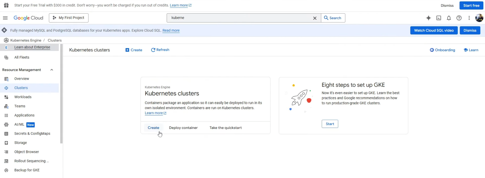<br>
  - 在 Kubernetes Engine 的 Clusters 頁面，點選 Create

  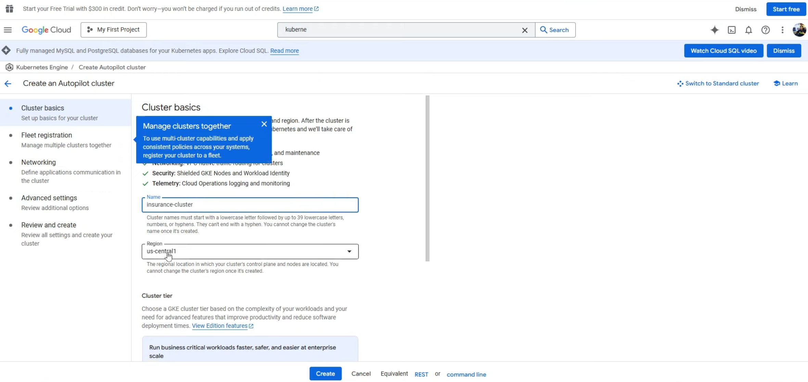<br>
  - Name：insurance-cluster
  - Region：us-central1

  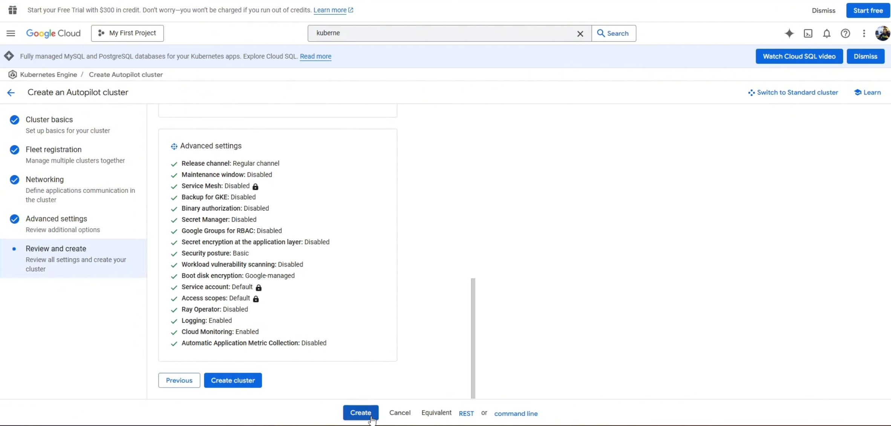<br>
  - 在 Review and create 分頁時，點選 create 

  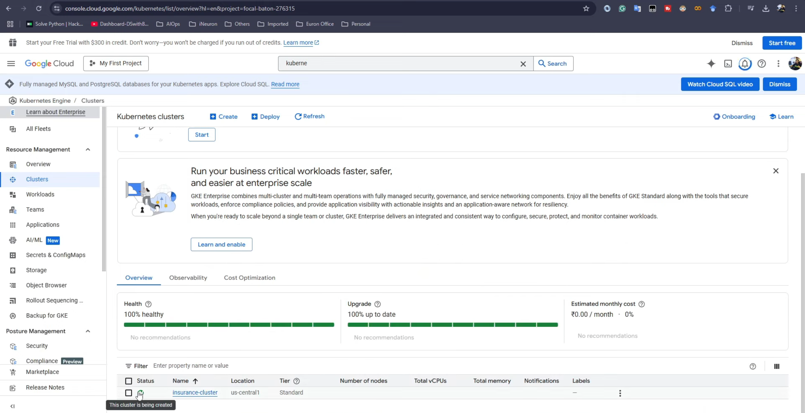<br>
  - insurance-cluster 的 status 顯示仍在建立中 (**This cluster is being created**)

  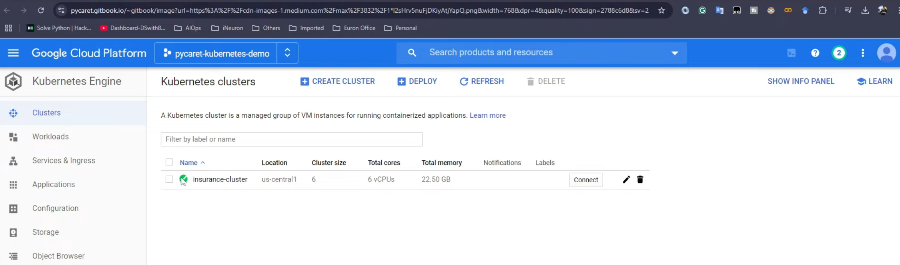<br>
  - cluster is getting created

* 部署應用程式在 Kubernetes clusters

  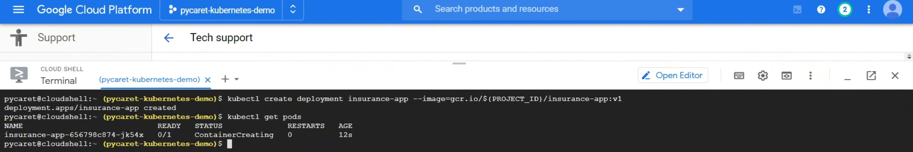<br>
  - 執行 `kubectl create deployment insurance-app --image=gcr.io/${PROJECT_ID}/insurance-app:v1`
    * 指令 Kubernetes (K8s) 在你剛建立的叢集中，根據雲端的映像檔跑起你的保險應用程式
    <pre>
    ✦ kubectl：這是控制 Kubernetes 叢集的標準工具（就像是遙控器）。
    ✦ create deployment：建立一個「部署設定」。Deployment 是 K8s 的核心機制，它不只是執行程式，還會幫你監控，如果程式當掉了，它會自動重啟。
    ✦ insurance-app：這是你在 K8s 內部給這個部署起的名字。
    ✦ --image=gcr.io/${PROJECT_ID}/insurance-app:v1：告訴 K8s 要去哪裡抓程式碼。它會到你之前 docker push 上傳過的 Google 倉庫去下載 v1 版本的映像檔。
    </pre>


* Expose the application
  
  - 執行 `kubectl expose deployment insurance-app --type=LoaderBalancer --port 80 --target-port 8080` (Demo沒顯示)
    - 為應用程式申請一個公網 IP 地址，並將外部流量導入容器中
    <pre>
    ✦ kubectl expose deployment insurance-app：告訴 Kubernetes 要將名為 insurance-app 的部署設定開放出來。
    ✦ --type=LoadBalancer（註：你輸入的 LoaderBalancer 多了一個 'r'，正確應為 LoadBalancer）：這是最關鍵的參數。它會要求 Google Cloud 自動幫你建立一個負載平衡器（Load Balancer），並分配一個外部靜態 IP 給你。
    ✦ --port 80：這是外部（對外）看到的通訊埠。一般網頁預設是 80，所以使用者只要輸入 IP 就能連線，不用特別加冒號。
    ✦ --target-port 8080：內部（容器裡）程式實際監聽的通訊埠。代表 Docker 映像檔裡面的程式（例如 Spring Boot, Node.js）原本是跑在 8080 埠。
    </pre>
  
  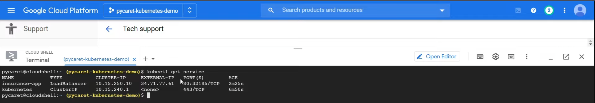<br>
  - 執行 `kubectl get service`，找到 insurance-app 的 EXTERNAL-IP，將其複製起來。

  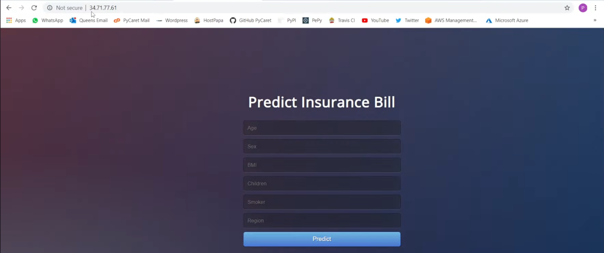<br>
  - 開啟 browser，網址輸入剛複製的 EXTERNAL-IP

* (27:21) Delete the cluster

  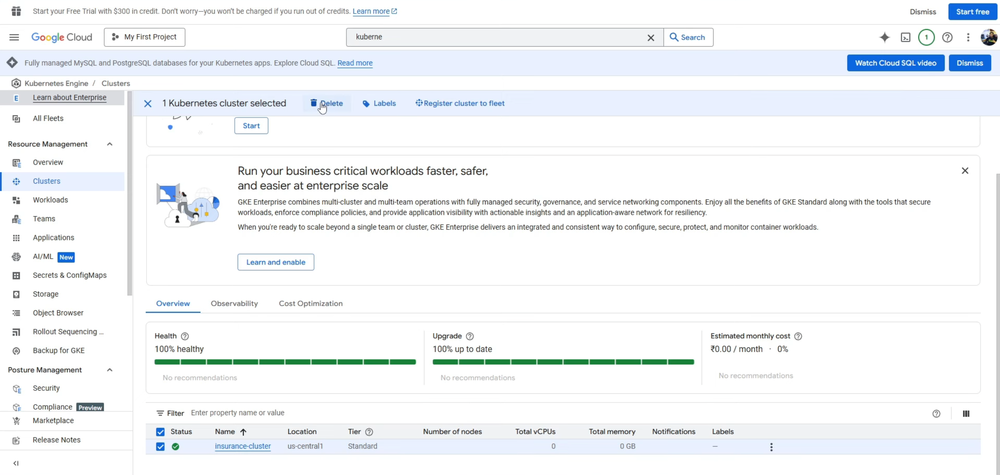<br>
  - 在 Kubernetes Engine 的 Clusters 頁面，點選欲刪除的 cluster 後，點選 Delete

  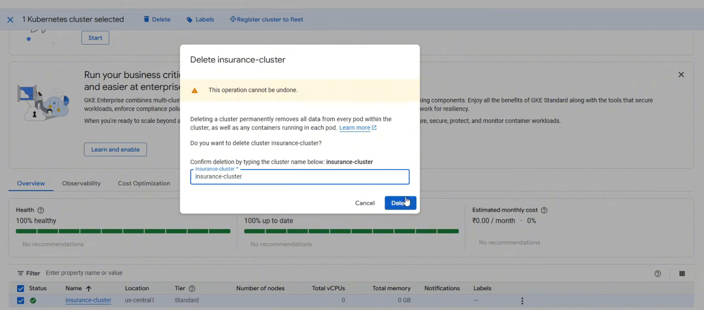<br>
  - 輸入 insurance-cluster 後，點選 Delete

  <br>
  - 刪除過程還在進行中的畫面
  
  <br>
  - 在 Repository 頁面中點選欲刪除的 docker image 存放資料夾後，點選 DELETE

  <br>
  - 點選 DELETE 確認刪除 

## ✪ Monitor Everything with Grafana | Grafana Dashboard Step by Step 

* [Lecture 12 Video](www.youtube.com/watch?v=fX8dIy6zGH8)

* (0:27) 
  - show the demo of grafana how we can create the grafana dashboard. 
  - show the entire step-by-step setup and after that we will use the grafana inside your project. 
  - Grafana is a open-source visualization tool with the help of that you can visualize any kinds of data. 
  - it can support all the data sources whether it's a database, whether it's any third party sources anything you can connect here
  - so, to set up the grapher now here we will be using the docker
  - first of all we'll try to launch EC2 instance and there we'll make the setup 
  - then with respect to the docker we'll try to set up the grafana there. 
  - So, let's open up the AWS account and there we'll try to create a sitto machine. 
  - Then show you how we can set up the grafana. 

* (1:25)

  <br>
  - 登入 AWS 後搜尋 ec2

  <br>
  - 點選 Launch instance

  <br>
  - name：grafana-demo

  <br>
  - 點選 Ubuntu

  <br>
  - Instance type：t2.medium

  <br>
  - 如果沒有存在的 key pair 可選，就點選 Create new key pair 

  <br>
  - 點選 Allow HTTPS traffic from the internet 與 Allow HTTP traffic from the internet
  - 點選 Launch instance，去完成建立

  <br>
  - 在 EC2 dashboard 點選 grafana-demo 的 Instance ID

  <br>
  - 點選 connect

* (3:08) 在 ec2 上執行 commands

  <br>
  - 執行 `sudo apt-get update -y`

  <br>
  - 執行 `sudo apt-get upgrade`

  <br>
  - 執行 `curl -fsSL https://get.docker.com -o get-docker.sh`
    - -f (fail): 如果 HTTP 請求失敗（例如 404 錯誤），則不輸出一任何內容，直接退出。
    - -s (silent): 靜音模式，不顯示進度條或錯誤訊息。
    - -S (show-error): 與 -s 搭配使用，如果出錯了，還是會顯示錯誤訊息。
    - -L (location): 如果伺服器回傳重定向（例如從 HTTP 轉到 HTTPS），curl 會自動跟隨到新網址。
  - 執行 `ls` (檢視用)
  - 執行 `sudo sh get-docker.sh`

  <br>
  - 執行 `sudo usermod -aG docker ubuntu`
  - 執行 `newgrp docker`

  <br>
  - 執行 `dpcker --version` (檢測用)


* (5:27) [Run Grafana Docker image](https://grafana.com/docs/grafana/latest/setup-grafana/installation/docker/)

  <br>
  - 執行 `docker run -d -p 3000:3000 --name=grafana grafana/grafana-oss`
    - docker run：Docker 的核心指令，用於建立並啟動一個新的容器。
    - -d (Detach)：背景執行模式。容器啟動後會在背景運作，不會佔用你目前的終端機視窗，讓你可繼續輸入其他指令。
    - -p 3000:3000 (Publish)：連接埠對應。格式為 主機連接埠:容器連接埠。這表示當你訪問主機的 http://localhost:3000 時，請求會被轉發到容器內的 3000 連接埠（Grafana 預設服務埠）。
    - --name=grafana：為這個容器指定一個自定義的名稱（grafana）。如果不設定，Docker 會隨機產生一個名字，指定名稱方便後續進行停止（stop）或刪除（rm）操作。
    - grafana/grafana-oss：指定要使用的映像檔（Image）名稱。grafana-oss 是 Grafana 官方提供的開源版本。

  <br>
  - 在 instance summary 頁面，點選 Security

  <br>
  - 點選欲修改的 security groups id

  <br>
  - 點選 Edit inbound rules

  <br>
  - Type：Custom TCP
  - Port range：3000
  - Source：Anywhere  (0.0.0.0/0)
  - 最後點選 Save rules

  <br>
  - 執行 `docker ps -a`
  - 執行 `docker ps`，用以確認名稱為 grafana-oss 的 docker image 是否成功運行。
 
  <br>
  - 在 instance summary 頁面複製 Public IPv4 address

  <br>
  - 開啟瀏覽器，輸入之前複製的 Public IPv4 address 並指定 port 為 3000
  - username：admin
  - password：admin

  <br>
  - 首次登入，要更新密碼

  <br>
  - 登入 Grafana 的歡迎頁面

* (10:22) [Prometheus](https://prometheus.io) -- 提供 docker run 的指令執行說明

* (11:01) [Prometheus - Installation](https://prometheus.io/docs/prometheus/latest/installation/)

  <br>
  - 執行 `docker run -p 9090:9090 prom/prometheus`

  <br>
  - 再次在 instance summary 頁面的 Security 下點選欲修改的 security group id

  <br>
  - Type：Custom TCP
  - Port range：9090
  - Source：Anywhere (0.0.0.0/0)
  - 最後點選 Save rules

  <br>
  - EC2 instance 的 rule 新增完後的畫面

  <br>
  - 開啟瀏覽器，輸入之前複製的 Public IPv4 address 並指定 port 為 9090

  <br>
  - 網址會自動跳轉加上 /graph

  <br>
  - 開啟 Prometheus 的畫面

  <br>
  - 瀏覽器，輸入之前複製的 Public IPv4 address 並指定 port 為 9090，並附加 /metrics

  <br>
  - 切換到 Grafana 頁面的 Connections 下 Data sources，在 Time series databases 點選 Prometheus

  <br>
  - 進入 Prometheus 的 setting 頁面

  <br>
  - Prometheus server URL：輸入之前複製的 Public IPv4 address 並指定 port 為 9090

  <br>
  - 在 Prometheus setting 頁面底，點選 Save & test

  <br>
  - 在 Grafana 的 Home 頁面，點選 Create your first dashboard

  <br>
  - 點選 Add visualization

  <br>
  - 在 Select data source 頁中點選 Prometheus

  <br>
  - 在 Dashboards 裡，Metric 中點選 go_gc_duration_seconds_count 後點選 Run queries

  <br>
  - 呈現的監測畫面

  <br>
  - 接著點選 Back to dashboard

  <br>
  - 按下 Add 點選 Visualization

  <br>
  - 切換畫面後，Metric 中點選 go_gc_heap_allocs_bytes_total 後點選 Run queries

  <br>
  - 呈現的監測畫面，接著點選 Back to dashboard 

  <br>
  - 呈現新的監測畫面，按下 refresh，即顯示 real time information~

  <br>
  - 在監測畫面，可以手動拖曳統計圖位置

  <br>
  - 再次按下 Add 點選 Visualization

  <br>
  - 切換畫面後，Metric 中點選 go_gc_heap_objects_object 後點選 Run queries

  <br>
  - 再次呈現的監測畫面，再次接著點選 Back to dashboard

  <br>
  - 呈現新的監測畫面，按下 refresh，即顯示 real time information~

* (17:30) 刪除 AWS EC2 instance

  <br>
  - 在 EC2 的 instances 頁面，選取欲刪除的 instance 後，點選 instance state 中 Terminate (delete) instance

  <br>
  - 點選 Terminate (delete) 確認刪除

  <br>
  - EC2 instance 確認刪除後跳轉的畫面
